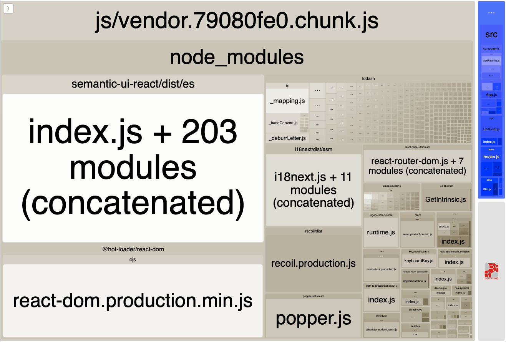

# Pokedex

## Table of content

- [Installation](#installation)
- [Component Library](#installation)
- [Functional CSS Library](#installation)
- [Writing CSS](#writing-css)
- [Configuring and Using PokeApi](#configuring-and-using-pokeapi)
- [State Management](#state-management)
- [npm scripts](#pokedex-npm-scripts)
- [Internationalization (i18n)](#poke-i18n)
- [Unit testing](#pokedex-unit-testing)
- [Pokedex a11y (Accessibility)](#pokedex-a11y-accessibility)


## Installation

`npm install`

`npm run start`

Launches the web application in development mode at [http://localhost:9999](http://localhost:9999)

## Component Library

We use [semantic-ui-react](https://react.semantic-ui.com/) as our primary component UI.  Not all components are enabled.  If you need to use a component that is not yet enabled simply uncomment the appropriate line in [src/css/semantic-ui.css](src/css/semantic-ui.css)

## Functional CSS

We use [tachyons](https://tachyons.io/) as helper library to avoid repeated css declarations.

Example:

```css
.my-flex-div {
	display: flex;
	justify-content: center;
	align-items: center;
	flex-wrap: wrap
}
```

Can be achieved via classes on the element

```html
<div className="flex flex-wrap items-center justify-center">
```

Not all of tachyons classes are enabled.  If you need to use a class that is not yet enabled simply uncomment the appropriate line in [src/css/tachyons.css](src/css/tachyons.css)

## Writing CSS

When writing new and component-specific css the css file should be created nexto to the component it is styling.  It should also be named identically. (NavIcon.js + NavIcon.css ).  Class names should always be in kebab-style without capitalization (.nav-icon).

### Using future CSS features

We use [PostCSS](https://postcss.org/) as our css pre-processor (not really a preprocessor, but we can debate this another time).  In conjunction with [postcss-preset-env](https://github.com/csstools/postcss-preset-env) we can use the latest proposals to the CSS spec very similar to how Babel allows us to use the latest proposals to JavaScript.

Example:

```css
.nav {
  & .nav-link { /* nav-link is a decendant of .nav.  Note the after the & */
    color: var(--white);

    &:hover { /* nav-link:hover */
      background-color: var(--mid-gray);
      color: var(--white);
    }

    &.active {/* nav-link.active */
      background-color: var(--blue);
    }
  }
}
```

### The Rules

CSS is notorius for becoming unwieldly in a project of almost any size.  So we have some rules to help.

**Rule #1:** Never, ever, ever put a hex color value in new css.  Always pick a color from [src/css/atomic/colors.css](src/css/atomic/colors.css).  If the color you need is not there, speak to a designer about adding a new color.

The colors can then be used in your css like so `color: var(--poke-blue)`

**Rule #2:** Use the functional CSS classes we have in place.

Very often you'll find that you need to write absolutely zero CSS in order to land a new component in the project if you utilize the functional CSS classes we've included.

**Rule #3:** Don't fight the browser, you'll lose.

No hacks.  They've likely already been handled in the css libs and utilities we have in place.

## Configuring and Using PokeApi.

```javascript
import PokeApi from 'poke-api'
```

### All endpoints are configured in JSON in endpoints.js

An endpoint loks like this:

```javascript
{
	types: {
		path: '/types',
		method: ['GET']
	}
}
```

### At this point you can use this endpoint like this:

```javascript
import PokeApi from "poke-api";

// as a chained promise.
PokeApi.types.get().then(response => console.log(response));

// or in an async function
const fetchTypes = async () => {
  const response = await PokeApi.types.get();
  console.log(response)
};

```

### We can make this easier by providing an alias inthe endpoint configuration.

```javascript
{
	types: {
		path: '/types',
		method: ['GET'],
		alias: 'Types'
	}
}

// PokeApi.types.get() can now be accessed as PokeApi.getTypes()
```

### To add variables to the api url preface the expected name in the path with a ":".

```javascript
{
	type: {
		path: '/type/:typeid',
		method: ['GET'],
		alias: 'Type'
	}
}
```

### We can now pass the `typeid` into our api call.

```
PokeApi.getType({ typeid: 1})
```

### To allow querystring params we can add then to the options section of an ednpoint configuration.

```javascript
{
	type: {
		path: '/type/:typeid',
		method: ['GET'],
		alias: 'Type'
		options: {
			get: {
				query: ['limit', 'offset']
			}
		}
	}
}
```

### We can now pass the path and query parameters into our api call.

```javascript
PokeApi.getType({ typeid: 1, limit: 10, offset: 15})
```

## State Management

We use [recoil](https://recoiljs.org/) as our state managment library.

The store can be accessed from within a component like this.

```javascript
import { favorites, getPokemonTypes, useRemoveFavorite } from 'poke-store';
```

## Pokedex npm scripts

`npm install`

Will install the upstream dependencies needed for the web application.

`npm run start`

Launches the web application in development mode at http://localhost:9999

`npm run build`

Builds a production version of the webapplication in `/build/`. This directory can then be served with any local server you may jave access to.  serve, http-server, or browser-sync are good node-based choices.

`npm run analyze`

Launches a Webpack Bundle Analyzer of our production build.  This great for figuring out what's making a bundle too large.

<p align="center"></p>

`npm run test`

Will run all unit tests in the application. A string or path may be passed in order to run singe tests or ssets of tests.

`npm run test:coverage`

Same as `npm run test`, but will also produce a coverage report in the terminal and an interactive report located `coverage/lcov-report/index.html`

#### Terminal Report
<p align="center"></p>

#### Interactive Report
<p align="center"></p>
    
`npm run lint`

Runs our eslint process and report it's findings

`npm run lint-fix`

Runs our attempt to automatically fix eslint error.

`npm run format`

Runs our prettier configuration. This happens autoamtically when commiting code.


## poke-i18n

We use [i18next](https://www.i18next.com/) for the internationalization (i18n) of our UI.

Plain English strings should be added to ./src/i18n/en.json and organized by feature or section of the application.

When appropriate we can have the strings in this file translated to another language in another language file.

### Usage:

**Import the translate function into your file.**

`import { translate } from 'poke-i18n'`

**Set namespace as array of string(s) only.**

`const t = translate(['signin'])`

Our namespace here is 'signin'.  This means we are looking for values in en.json nested under the key `signin`.

We can access more than one root key from our locase file.

`const t = translate(['signin', 'common'])`

In the event that the same key exists in more than one namespace the first namespace will be used.  Order of the keys becomes important in this situation.


**"t" can then be used in any Javascript file or with React classes or function components.**

`<p>{t('lostPassword')}</p>`

## Pokedex unit testing

We use [Jest](https://facebook.github.io/jest/) and [react-testing-library](https://github.com/kentcdodds/react-testing-library) for unit tests in pokedex.

### Running the unit tests

#### Run all tests with coverage report

`npm run test`

This will run all tests in the application without generating a coverage report.

### Run all tests without coverage report

`npm run test:coverage`

This will run all tests in the application and generate a coverage report in `./coverage/`. In this directory you'll find `lcov-report/index.html` which can be opened in a browser for review.

### Run specific tests with or without coverage report

`npm run test:coverage <pattern>`

This will run all tests where the filename matches the pattern and generate a coverage report for those tests.

`npm run test <pattern>`

This will run all tests where the filename matches the pattern without generating a coverage report for those tests.

### Set a watch

`npm run test <pattern> --watch`

This will run all tests where the filename matches the pattern without generating a coverage report for those tests. This will also rerun any time the test(s) are changed.

## Writing unit tests

### Organization and Naming Convention

Unit tests are located next to the code or component they test.
Filenames should be identical to the code or component tested, but with an extension of `.test.js`.

Example naming:`Application.js` --> `Application.test.js`

### An example unit test

```javascript
import React from 'react'; // import as needed if testing a React component
import renderWith from '../test-util/renderWith'; // This is our abstracted test renderer for React components

describe('<Component />', () => { // Describe the suite of tests about to be run
	beforeEach(() => {
		// A set of commands or variables defined before each test.
		// This is often where you will build up a set of common props for React Components
	})

	afterEach(() => {
		// If needed, this is for cleaning up after each test.
		// However, you'll seldom need this as we've automated a cleanup process.
	})

	it('renders', () => {
		// Render our React component using renderWith.
		const { getByTestId } = renderWith(<Component {...props} />, {
      		withStore: true,
    	});
		// Assert the component was rendered successfully.
		expect(getByTestId('some-test-id')).toBeInTheDocument();
	});
})
```

### renderWith utility

#### Summary

*   Wrap a component in a Store Provider, `{ withStore true }`
*   Wrap a component inthe appropriate react-router Router, `{ withRouter: true }`


#### Examples:

```javascript
const { getTestById } = renderWith(<Component />);
```

Works identically to react-testing-library's `render`.

### Options examples

```javascript
{
	withStore: true || false,
	// default = false, wraps component in a RecoilRoot

	withRouter: true || false,
	// default = false, wraps component in a MemoryRouter or BrowserRouter accordingly,

}
```

#### Notes about usage

You'll probably never need to:

```javascript
import { render } from 'react-testing-library';
```

Because you can just

```javascript
import renderWith from './renderWith';
```

# Pokedex a11y (accessibility)

## Some common accessibility issues.


### jsx-a11y/anchor-is-valid [link to rule](https://github.com/evcohen/eslint-plugin-jsx-a11y/blob/master/docs/rules/anchor-is-valid.md)

This issue presents whenever you use an anchor tag with an href of # or javascript:void(0).
Use a button instead with a className of `anchor-button`

#### Bad

```html
<a href="#">linky</a>
```

#### Good

```html
<button type="button" className="anchor-button">linky</button>
```


### jsx-a11y/click-events-have-key-events [link to rule](https://github.com/evcohen/eslint-plugin-jsx-a11y/blob/master/docs/rules/click-events-have-key-events.md)

Visible, non-interactive elements with click handlers must have at least one keyboard listener.  This often comes up whenever you try to add a click event to something that isn't a button or an anchor tag, like a `div` or an `img` tag.

We have three methods for handling this.

1.  Use the `<KeyClick>` component.
    Wrap your component in the KeyClick HOC and pass your click event in as the `handler` prop.

2.  Use `a11yClickEvent` decorator directly.
    Decorate your click/key event in @a11yClickEvent.
    Add onClick and onKeyDown events to your component referencing the same event.

3.  Manually create a key event and a click event

#### Bad

```html
<button onClick={this.clickHandler}>Clicky</button>
```

#### Good

```html
<KeyClick handler={this.clickHandler}>
    <button>Clicky</button>
</KeyClick>
```

### jsx-a11y/no-noninteractive-tabindex [link to rule](https://github.com/evcohen/eslint-plugin-jsx-a11y/blob/master/docs/rules/no-noninteractive-tabindex.md)

If you find you need to add a tabIndex attribute to an item the simplest solution is usually to add a role attribute of "button" to the element.

#### Bad

```html
<div tabIndex={0}>stuff</div>
```

#### Good

```html
<div role="button" tabIndex={0}>stuff</div>
```

### jsx-a11y/label-has-for [link to rule](https://github.com/evcohen/eslint-plugin-jsx-a11y/blob/master/docs/rules/label-has-for.md)

Ensure that each `<label />` has an `htmlFor` value matching a form element id.


### jsx-a11y/mouse-events-have-key-events [link to rule](https://github.com/evcohen/eslint-plugin-jsx-a11y/blob/master/docs/rules/mouse-events-have-key-events.md)

This is much less common in our codebase so far.

*   Copy onMouseEnter/onMouseOver into onFocus.
*   Copy onMouseOut/onMouseLeave into onBlur.

### jsx-a11y/no-static-element-interactions [link to rule](https://github.com/evcohen/eslint-plugin-jsx-a11y/blob/master/docs/rules/no-static-element-interactions.md)

This occurs when you have an non-interacvtive element (usually a div) with an onClick attribute and nested components. The click event is expected to bubble up to the non-interactive element. Simply add `role="presentation"` to the non-interactive element.


